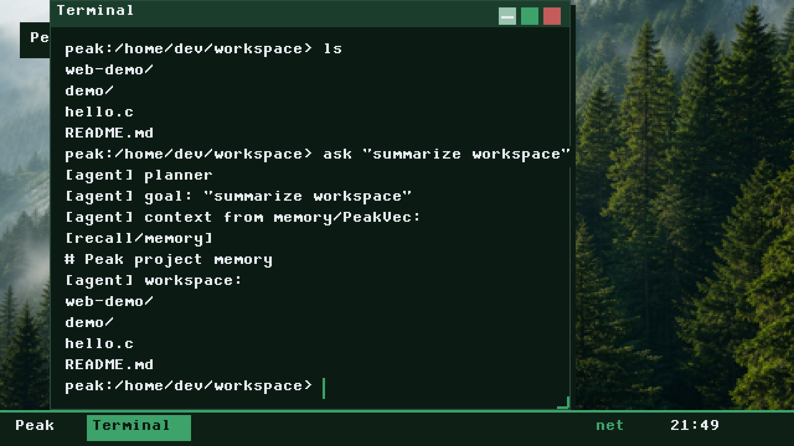
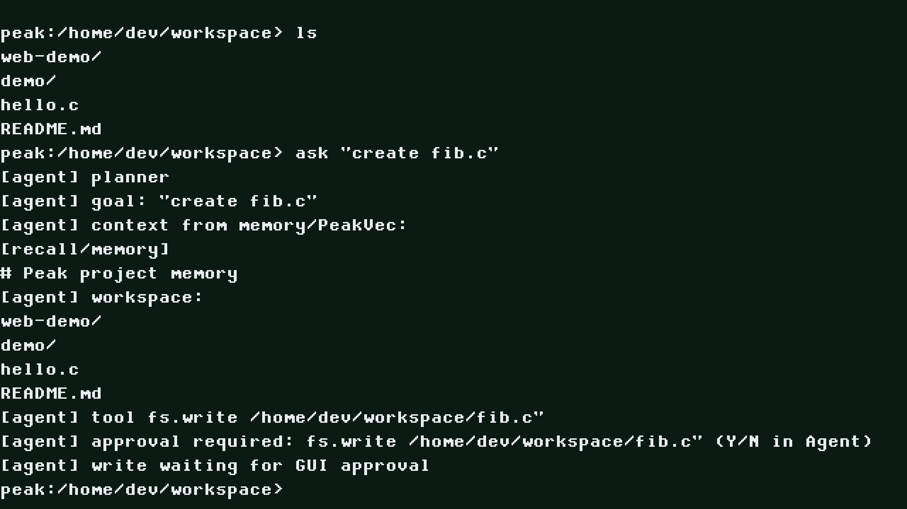
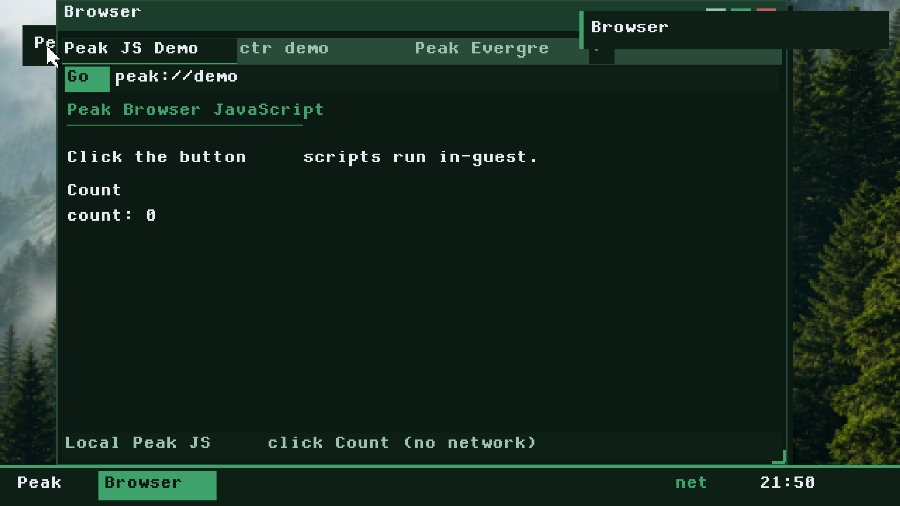
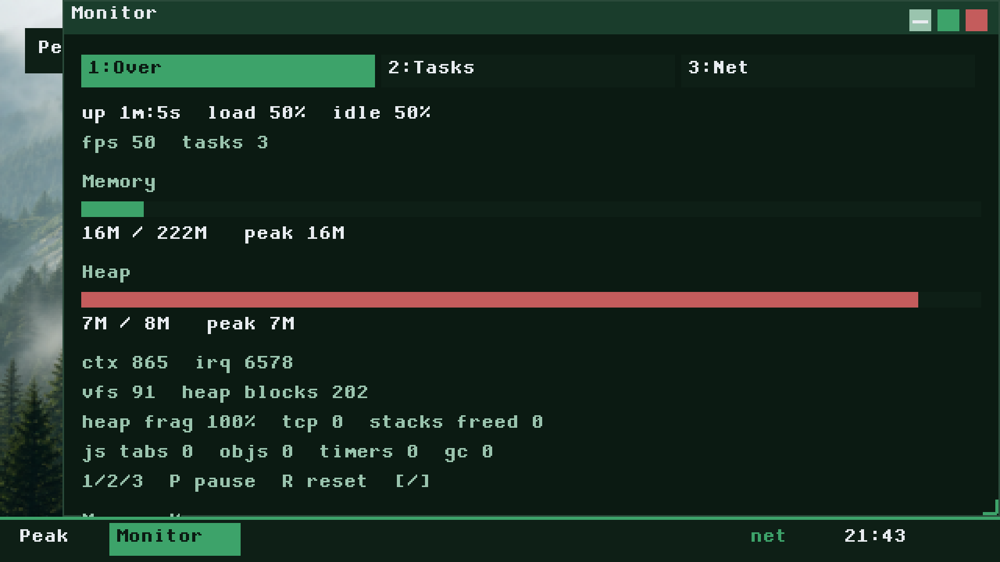
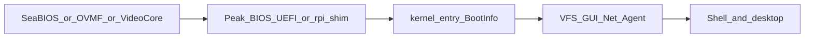

<p align="center">
  
</p>

# Peak OS

**From-scratch, AI-first developer OS** — a freestanding C kernel with its own bootloaders, VFS workspace, peak-agent, CLI, and desktop. Runs as a QEMU guest today; ships a flashable Raspberry Pi SD image (Pi 3 hardware sign-off still pending). No Linux or Limine dependency.

[](https://github.com/peakevergreen/peak-os/actions/workflows/ci.yml)
[](LICENSE)

Baseline tag: `v0.1.0-mvp` · Current: **0.2.0-ai** (see [CHANGELOG.md](CHANGELOG.md))

## Why Peak OS?

Most “hobby OS” projects stop at a bootloader and a shell. Peak OS aims further: an **in-guest** networking stack (including TLS), a real desktop and browser surface, containers, and an agent that plans against local tools — all Peak-authored C, not host bridges.

- **x86_64 PC** — Peak BIOS + UEFI, hybrid ISO
- **aarch64 Raspberry Pi** — flashable SD image (`kernel8.img`); Pi 3 is the primary hardware gate
- **In-guest everything** — DHCP/DNS/TCP/TLS/HTTP, `ctr` demos, Peak JS browser subset
- **MIT licensed** Peak code — keep the copyright line when you reuse it ([LICENSE](LICENSE))

## Supported platforms

| Target | Status |
|--------|--------|
| x86_64 QEMU SeaBIOS ISO | **Supported** (CI smoke) |
| x86_64 QEMU UEFI (OVMF) | **Supported** locally; not in default CI |
| aarch64 QEMU `virt` | **Supported** (CI serial smoke) |
| Raspberry Pi 3 SD image | **Built in CI**; HDMI/USB **hardware acceptance pending** |
| Pi 4/5 Ethernet, xHCI, Wi‑Fi, GPU accel | **Not ready** (staged / stubs) |

Capability matrix and firmware policy: [docs/rpi.md](docs/rpi.md). What’s next: [docs/ROADMAP.md](docs/ROADMAP.md).

## Screenshots

Captured from QEMU (`scripts/run-qemu.sh` + monitor `screendump`). Drop updated PNGs in [`assets/screenshots/`](assets/screenshots/).

| Desktop | Shell |
|---------|--------|
|  |  |

| Browser | System monitor |
|---------|----------------|
|  |  |

> If a screenshot is missing after a fresh clone, regenerate with QEMU graphical boot and `screendump` (see [assets/screenshots/README.md](assets/screenshots/README.md)).

## Quick start (macOS) — x86_64

```bash
./scripts/setup-mac.sh
export PATH="/opt/homebrew/opt/llvm/bin:$PATH"
make doctor
make iso
./scripts/run-qemu.sh
# UEFI:
PEAK_FIRMWARE=uefi ./scripts/run-qemu.sh
```

Retina tip: zoom-to-fit is on by default. `PEAK_FULLSCREEN=1` or `PEAK_RES=1920x1080` for a larger guest FB. Guest UI defaults to **3×** scale (`scale 1..4` in the shell). Product profile for desktop stress: **1080p @ scale 3**.

## Quick start — Raspberry Pi (aarch64)

```bash
export PATH="/opt/homebrew/opt/llvm/bin:$PATH"
make ARCH=aarch64 doctor
make ARCH=aarch64 pi-image          # → build/peak-os-rpi-arm64.img
make ARCH=aarch64 pi-image-check
make ARCH=aarch64 flash-pi DEVICE=/dev/diskN   # guarded; or Imager / Etcher / dd
```

Full guide: [docs/rpi.md](docs/rpi.md) (HDMI/USB acceptance, UART recovery, firmware policy). Treat silicon bring-up as incomplete until the Pi 3 checklist passes.

## How it works



Peak loaders hand a versioned **BootInfo** (memory map, framebuffer, HHDM, optional DTB) to `kernel_entry`. Portable subsystems sit above thin `arch_*` / `platform_*` / `blockdev` / `netdev` seams. Details: [ARCHITECTURE.md](ARCHITECTURE.md), [docs/from-scratch.md](docs/from-scratch.md).

## Documentation

| Doc | Topic |
|-----|--------|
| [docs/README.md](docs/README.md) | Full docs index |
| [ARCHITECTURE.md](ARCHITECTURE.md) | Kernel layout and HAL |
| [docs/ROADMAP.md](docs/ROADMAP.md) | What’s next |
| [CHANGELOG.md](CHANGELOG.md) | Release notes |
| [SECURITY.md](SECURITY.md) | Vulnerability reporting |
| [docs/CLI.md](docs/CLI.md) | Shell and `/bin` tools |
| [docs/rpi.md](docs/rpi.md) | Raspberry Pi ARM64 |
| [docs/network.md](docs/network.md) | In-guest networking + TLS |
| [docs/containers.md](docs/containers.md) | Peak containers |
| [docs/browser-js.md](docs/browser-js.md) | Browser + Peak JS |
| [docs/security-model.md](docs/security-model.md) | Security model |
| [docs/privacy.md](docs/privacy.md) | Privacy |
| [CONTRIBUTING.md](CONTRIBUTING.md) | Setup and MR checks |

## In the guest

| Command | What it does |
|---------|----------------|
| `help` / `man <cmd>` | Categorized CLI help |
| `pwd` `cd` `ls -l` `mkdir` `rm` `cp` `grep` … | `/bin` utility pack ([docs/CLI.md](docs/CLI.md); quotes supported) |
| `theme list` / `theme set amber` | Shared CLI + GUI themes |
| `scale 1..4` | UI glyph/chrome scale (default 3) |
| `ask "create fib.c"` | peak-agent (in-guest planner) |
| `js -e '1+2'` | Peak JS CLI |
| `privacy` | Persist profile / net-allow / kill-switch |
| `gui` | Multi-window desktop (Ctrl+Alt+Esc leaves) |
| `ctr build` / `ctr run` | In-guest demos |
| Browser (GUI) | Tabs; `http(s)://` via in-guest stack |
| `ifconfig` / `ping` / `wget` | IPv4 + TLS tools |
| `top` / `sysmon` / `ps` | Live system monitor + task list |

Desktop stress checklist: [scripts/gui-stress-checklist.md](scripts/gui-stress-checklist.md).

## Networking and containers

```bash
./scripts/run-qemu.sh
# guest: ifconfig && wget https://example.com/
# gui → Browser → URL → Enter
```

```bash
# guest: ctr build && ctr run && gui → Browser (local demo)
# LAN: PEAK_NET_MODE=bridged PEAK_NET_IFACE=en0 ./scripts/run-qemu.sh
```

See [docs/network.md](docs/network.md) and [docs/containers.md](docs/containers.md).

## Build targets

```bash
make iso                         # build/peak-os.iso (Peak BIOS + UEFI)
make smoke-bios                  # SeaBIOS QEMU smoke
make smoke-uefi                  # OVMF QEMU smoke (local / pre-release)
make ARCH=aarch64 pi-image       # Raspberry Pi SD image
make ARCH=aarch64 smoke-aarch64  # QEMU aarch64 serial smoke
make test-host                   # host unit tests
./scripts/purity-check.sh
make run
make clean
```

## Limits — not this project

- **Not** Linux ABI / glibc userspace — Peak `/bin/*` builtins; ELF loader scaffolding only
- **No** GPU acceleration, Wayland, or multi-monitor — software linear framebuffer + compositor
- **No** host LLM or serial agent bridges — planner stays in-guest
- **No** verified boot / signed releases yet (Phase S8)
- Pi **userspace ELF** deferred; USB LAN / Wi‑Fi / GPU drivers **not ready**
- QEMU `display: vblank=1` is an IS1 probe, not tear-free hardware proof ([docs/rpi.md](docs/rpi.md))

Raspberry Pi **boot/Wi‑Fi firmware** is a documented binary exception ([LICENSE](LICENSE), [docs/rpi.md](docs/rpi.md)). Peak-authored drivers remain MIT.

Roadmap / next work: [docs/ROADMAP.md](docs/ROADMAP.md).

## License

MIT — see [LICENSE](LICENSE). Please keep the copyright notice when you redistribute Peak-authored code.
